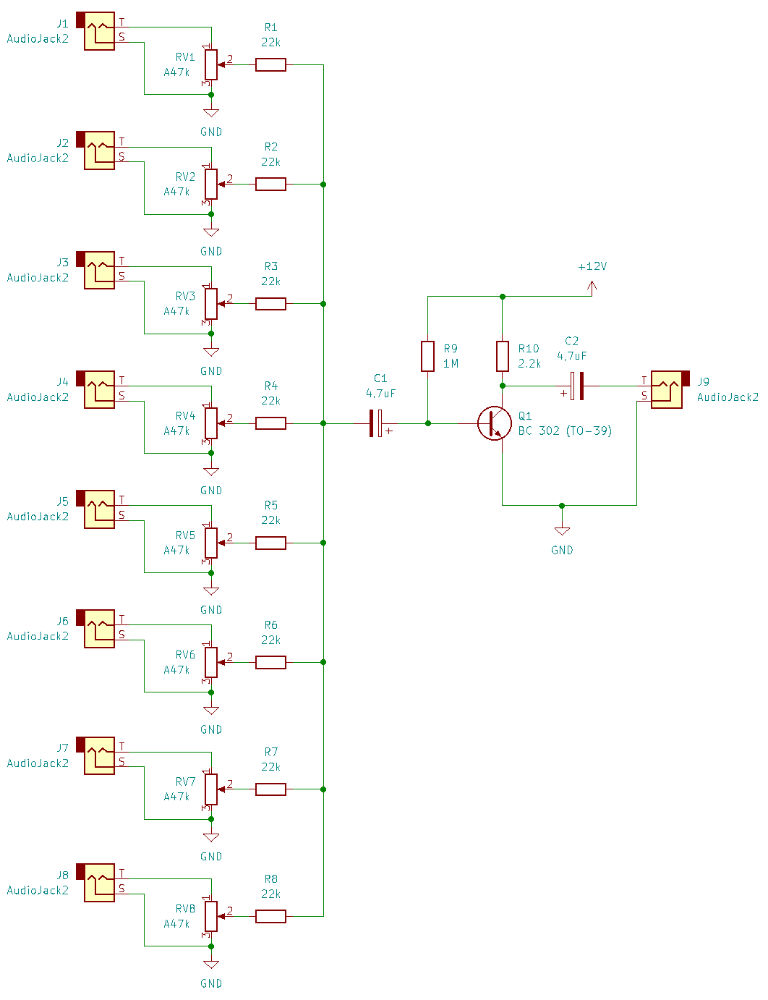

# Simple 8 Channel Audio Mixer

I ran out of mixer channels in my small audio lab. In order to be able to sum up some uncomplicated channels before routing them into my main mixer I built this super easy 8 channel mixer (can by extend by any number of additional channels).

## Circuit Diagram

I am a bit proud that I used an old BC 302 transistor in a TO-39 package from my old stock from the 1980s.

